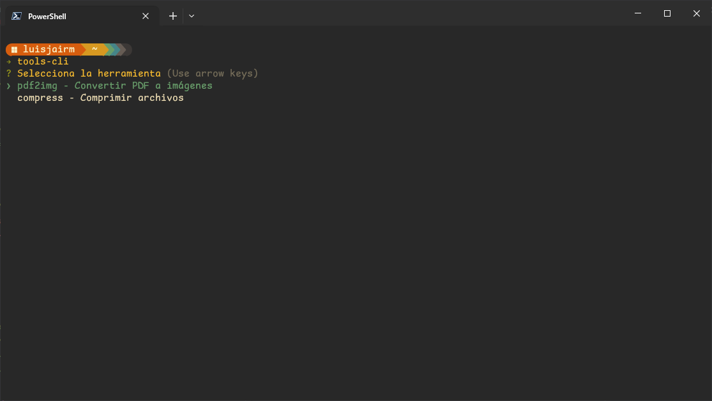
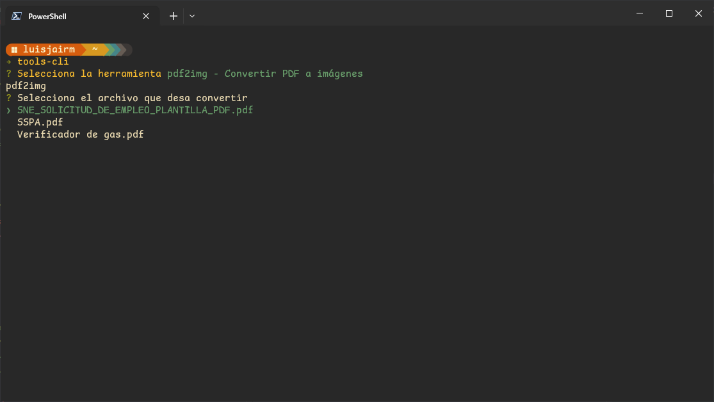
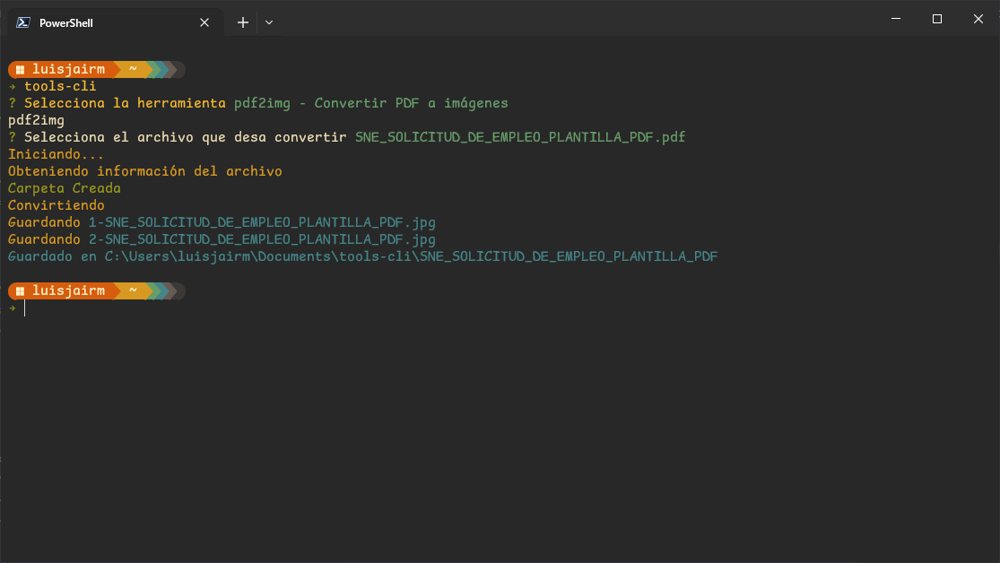

# TOOLS CLI
Es una colección de herramientas de terminal
- [TOOLS CLI](#tools-cli)
  - [Requerimientos](#requerimientos)
  - [Instalación](#instalación)
  - [Herramientas disponibles](#herramientas-disponibles)
    - [Convertir pdf a imagenes](#convertir-pdf-a-imagenes)

## Requerimientos 
Para que las utilidades de pdf funcionen debe tener instalado previamente:
- Windows: [Ghostscript](https://ghostscript.com/releases/gsdnld.html)
, [ImageMagik](https://imagemagick.org/script/download.php#windows)

## Instalación
1. Una vez instalado ejecutamos lo siguiente en la terminal, esto creara la carpeta `tools-cli` dentro de la carpeta `Documents` 
~~~bash
tools-cli -c
~~~
## Herramientas disponibles
### Convertir pdf a imagenes
Para poder utlizar esta herramienta debemos ejecutar los siguientes pasos:
1.  Mover nuestros archivos pdf dentro de la carpeta de nuestro espacio de trabajo `tools-cli`.
2.  Ejectar los siguiente en la terminal:
~~~bash
tools-cli
~~~
3. Seleccionamos la opción, con las flechas `arriba` y `abajo`

4. Seleccionamos el archivo a convertir.

5. Esperamos a que se conviertan correctamente

